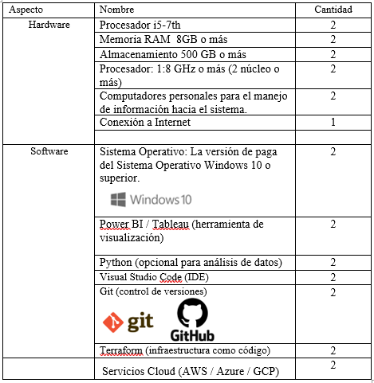

[comment]: 

**UNIVERSIDAD PRIVADA DE TACNA**

**FACULTAD DE INGENIERIA**

**Escuela Profesional de Ingeniería de Sistemas**

**Proyecto *Dashboard de análisis electoral y evaluación de planes de gobierno - Perú 2021***

Curso: *Inteligencia de Negocios*

Docente: *Mag. Patrick Jose Cuadros Quiroga*

Integrantes:

***Chura Ticona, Mary Luz        (2019065163)***
***Diego Chara Apaza			 (2019065026)***

**Tacna – Perú**

***2026***

**  
**

\pagebreak

Sistema *Dashboard de análisis electoral y evaluación de planes de gobierno – Perú 2021*

Informe de Factibilidad

Versión *{1.0}*

|CONTROL DE VERSIONES||||||
| :-: | :- | :- | :- | :- | :- |
|Versión|Hecha por|Revisada por|Aprobada por|Fecha|Motivo|
|1\.0|MPV|ELV|ARV|10/10/2020|Versión Original|

\pagebreak

# **INDICE GENERAL**

[1. Descripción del Proyecto](#_Toc52661346)

[2. Riesgos](#_Toc52661347)

[3. Análisis de la Situación actual](#_Toc52661348)

[4. Estudio de Factibilidad](#_Toc52661349)

[4.1 Factibilidad Técnica](#_Toc52661350)

[4.2 Factibilidad económica](#_Toc52661351)

[4.3 Factibilidad Operativa](#_Toc52661352)

[4.4 Factibilidad Legal](#_Toc52661353)

[4.5 Factibilidad Social](#_Toc52661354)

[4.6 Factibilidad Ambiental](#_Toc52661355)

[5. Análisis Financiero](#_Toc52661356)

[6. Conclusiones](#_Toc52661357)

\pagebreak

**<u>Informe de Factibilidad</u>**

1. **Descripción del Proyecto**

### 1.1 Nombre del proyecto
Dashboard de análisis electoral y evaluación de planes de gobierno – Perú 2021

### 1.2 Duración del proyecto

- Fecha de inicio: 13 de abril del 2026  
- Fecha de finalización: 13 de julio del 2026  
- Duración estimada: 3 meses  

### 1.3 Descripción 

    1.3. Descripción

        El presente proyecto consiste en el desarrollo de un dashboard interactivo de análisis electoral y evaluación de planes de gobierno, basado en las Elecciones Generales del Perú 2021. La solución busca integrar, organizar y visualizar información electoral relevante, permitiendo analizar resultados, comparar candidatos presidenciales y evaluar sus principales propuestas de gobierno.

        El dashboard permitirá representar datos como votos obtenidos por candidato, distribución porcentual de resultados, comparación de propuestas por sectores y análisis de viabilidad según criterios como impacto, costo estimado y alineación con necesidades sociales. De esta manera, se busca transformar información electoral dispersa en una herramienta visual, clara y útil para la toma de decisiones.

        Asimismo, el proyecto incorporará información relacionada con los planes de gobierno de los principales candidatos presidenciales, clasificando sus propuestas en sectores como educación, salud, economía, seguridad e infraestructura. Esta clasificación permitirá comparar de forma objetiva las prioridades de cada candidato.

        El sistema estará orientado a estudiantes, ciudadanos, analistas y usuarios interesados en comprender mejor el proceso electoral peruano, brindando una plataforma que facilite la interpretación de datos políticos y electorales mediante gráficos, indicadores y reportes visuales.
        En resumen, el proyecto representa una solución tecnológica enfocada en el análisis de datos electorales, la transparencia de la información y la comparación estructurada de planes de gobierno, contribuyendo al fortalecimiento de la cultura democrática y la toma de decisiones informadas.

    1.4. Objetivos

        1.4.1 Objetivo general

        - Desarrollar un dashboard interactivo de análisis electoral y evaluación de planes de gobierno basado en las Elecciones Generales del Perú 2021, que permita visualizar resultados, comparar candidatos y analizar la viabilidad de sus propuestas mediante indicadores gráficos y métricas de evaluación.
        
        1.4.2 Objetivos Específicos
            - Recopilar y organizar información electoral de las Elecciones Generales del Perú 2021.
            - Identificar a los principales candidatos presidenciales y sus propuestas de gobierno.
            - Clasificar las propuestas por sectores como educación, salud, economía, seguridad e infraestructura.
            - Diseñar indicadores que permitan evaluar el costo estimado, impacto y viabilidad de las propuestas.
            - Implementar dashboards o reportes visuales que faciliten la comparación entre candidatos.
            - Desarrollar una estructura de datos que permita alimentar los gráficos e indicadores del sistema.
            - Publicar el proyecto en un entorno accesible para su revisión y presentación.

\pagebreak

2. **Riesgos**
 - Dificultad para encontrar información completa y ordenada sobre los planes de gobierno.
- Posible inconsistencia entre las fuentes de información electoral consultadas.
- Retrasos en la limpieza y estructuración de los datos.
- Errores en la clasificación de propuestas por sector.
- Limitaciones técnicas en el diseño del dashboard.
- Falta de experiencia del equipo en herramientas de visualización de datos.
- Riesgo de interpretar de forma subjetiva las propuestas políticas.
- Dificultad para estimar costos reales de algunas propuestas de gobierno.
- Posibles problemas al publicar el dashboard en un entorno web o repositorio público.
*

\pagebreak

3. **Análisis de la Situación actual**

    3.1. Planteamiento del problema

            En el Perú, la información electoral y los planes de gobierno suelen encontrarse distribuidos en diferentes fuentes, documentos oficiales, portales institucionales y medios digitales. Esta dispersión dificulta que los ciudadanos puedan analizar de manera rápida y clara las propuestas de los candidatos presidenciales.
            Durante las Elecciones Generales del Perú 2021, los ciudadanos tuvieron acceso a diversos planes de gobierno; sin embargo, estos documentos suelen ser extensos, técnicos y poco comparables entre sí. Esto limita la capacidad de los electores para identificar diferencias entre candidatos, prioridades de gobierno y niveles de viabilidad de las propuestas.
            Asimismo, los resultados electorales suelen presentarse en plataformas oficiales, pero muchas veces no se integran con el análisis de propuestas o indicadores de impacto. Por ello, existe la necesidad de una herramienta que combine visualización electoral, comparación de candidatos y evaluación de planes de gobierno en un solo entorno.
            En este contexto, se propone desarrollar un dashboard de análisis electoral y evaluación de planes de gobierno basado en las Elecciones Generales del Perú 2021, con el objetivo de facilitar la interpretación de datos, fortalecer la transparencia informativa y promover una toma de decisiones más informada.

    3.2. Consideraciones de hardware y software

            Con respecto a los recursos tecnológicos requeridos para el desarrollo del proyecto de dashboard de análisis electoral, se consideran los siguientes componentes de hardware y software necesarios para la recopilación, procesamiento y visualización de datos.
            
            
           

  
   
  <em>Figura: Herramientas de software utilizadas</em>

            
            

\pagebreak

4. **Estudio de
    Factibilidad**

    Describir los resultados que esperan alcanzar del estudio de factibilidad, las actividades que se realizaron para preparar la evaluación de factibilidad y por quien fue aprobado.

    4.1. Factibilidad Técnica

        El estudio de viabilidad técnica se enfoca en obtener un entendimiento de los recursos tecnológicos disponibles actualmente y su aplicabilidad a las necesidades que se espera tenga el proyecto. En el caso de tecnología informática esto implica una evaluación del hardware y software y como este puede cubrir las necesidades del sistema propuesto.

        Realizar una evaluación de la tecnología actual existente y la posibilidad de utilizarla en el desarrollo e implantación del sistema.*

        Describir acerca del hardware (equipos, servidor), software (aplicaciones, navegadores, sistemas operativos, dominio, internet, infraestructura de red física, etc.

    4.2. Factibilidad Económica

        El proyecto de dashboard de análisis electoral es técnicamente viable, ya que se basa en el uso de herramientas ampliamente utilizadas en el análisis y visualización de datos, como Power BI, Microsoft Excel y lenguajes de programación como Python.

Estas tecnologías permiten la recopilación, procesamiento y representación gráfica de grandes volúmenes de información electoral de manera eficiente, facilitando la construcción de dashboards interactivos que permiten comparar candidatos, resultados y propuestas de gobierno.

Asimismo, el desarrollo del sistema se realizará de manera progresiva, iniciando con la recopilación y limpieza de datos provenientes de fuentes oficiales como la ONPE, seguido de la estructuración de la información y finalmente la implementación de dashboards interactivos. Este enfoque incremental permite reducir riesgos técnicos y asegurar la correcta construcción del sistema.

Desde el punto de vista de infraestructura, el proyecto puede ser desplegado utilizando servicios en la nube como AWS o Azure, mediante el uso de herramientas de infraestructura como código como Terraform, lo que permite automatizar la configuración del entorno, optimizar recursos y reducir costos operativos.

En cuanto al entorno tecnológico, el sistema es viable debido a que las herramientas utilizadas son accesibles, cuentan con documentación amplia y no requieren infraestructura compleja para su implementación. Además, los usuarios finales están familiarizados con el uso de dashboards y plataformas digitales, lo que facilita la adopción del sistema.

Finalmente, el proyecto no requiere el desarrollo de aplicaciones móviles ni el uso de tecnologías complejas como geolocalización o notificaciones en tiempo real, lo que reduce significativamente la complejidad técnica y aumenta su viabilidad.
    *

        Definir los siguientes costos:

        4.2.1. Costos Generales

                El proyecto es económicamente viable, ya que no requiere una inversión elevada en infraestructura y utiliza herramientas accesibles para el desarrollo de dashboards y análisis de datos. Los costos están asociados principalmente a recursos operativos, ambiente tecnológico y personal.

        4.2.2. Costos operativos durante el desarrollo 
        
                Evaluar costos necesarios para la operatividad de las actividades de la empresa durante el periodo en el que se realizara el proyecto. Los costos de operación pueden ser renta de oficina, agua, luz, teléfono, etc.

        4.2.3. Costos del ambiente

                Evaluar si se cuenta con los requerimientos técnicos para la implantación del software como el dominio, infraestructura de red, acceso a internet, etc.

        4.2.4. Costos de personal

                Aquí se incluyen los gastos generados por el recurso humano que se necesita para el desarrollo del sistema únicamente.

                No se considerará personal para la operación y funcionamiento del sistema.

                Incluir tabla que muestra los gastos correspondientes al personal.

                Indicar organización y roles. Indicar horario de trabajo del personal.

        4.2.5.  Costos totales del desarrollo del sistema

                {Totalizar costos y realizar resumen de costo final del proyecto y la forma de pago.

    4.3. Factibilidad Operativa

        Describir los beneficios del producto y si se tiene la capacidad por parte del cliente para mantener el sistema funcionando y garantizar el buen funcionamiento y su impacto en los usuarios. Lista de interesados.

    4.4. Factibilidad Legal

        Determinar si existe conflicto del proyecto con restricciones legales como leyes y regulaciones del país o locales relacionadas con seguridad, protección de datos, conducta de negocio, empleo y adquisiciones.

    4.5. Factibilidad Social 

        Evaluar influencias y asuntos de índole social y cultural como el clima político, códigos de conducta y ética*

    4.6. Factibilidad Ambiental

        Evaluar influencias y asuntos de índole ambiental como el impacto y repercusión en el medio ambiente.

\pagebreak

5. **Análisis Financiero**

    El plan financiero se ocupa del análisis de ingresos y gastos asociados a cada proyecto, desde el punto de vista del instante temporal en que se producen. Su misión fundamental es detectar situaciones financieramente inadecuadas.
    Se tiene que estimar financieramente el resultado del proyecto.

    5.1. Justificación de la Inversión

        5.1.1. Beneficios del Proyecto

            El beneficio se calcula como el margen económico menos los costes de oportunidad, que son los márgenes que hubieran podido obtenerse de haber dedicado el capital y el esfuerzo a otras actividades.
            El beneficio, obtenido lícitamente, no es sólo una recompensa a la inversión, al esfuerzo y al riesgo asumidos por el empresario, sino que también es un factor esencial para que las empresas sigan en el  mercado e incorporen nuevas inversiones al tejido industrial y social de las naciones.
            Describir beneficios tangibles e intangibles*
            Beneficios tangibles: son de fácil cuantificación, generalmente están relacionados con la reducción de recursos o talento humano.
            Beneficios intangibles: no son fácilmente cuantificables y están relacionados con elementos o mejora en otros procesos de la organización.
>
            Ejemplo de beneficios:

            - Mejoras en la eficiencia del área bajo estudio.
            - Reducción de personal.
            - Reducción de futuras inversiones y costos.
            - Disponibilidad del recurso humano.
            - Mejoras en planeación, control y uso de recursos.
            - Suministro oportuno de insumos para las operaciones.
            - Cumplimiento de requerimientos gubernamentales.
            - Toma acertada de decisiones.
            - Disponibilidad de información apropiada.
            - Aumento en la confiabilidad de la información.
            - Mejor servicio al cliente externo e interno
            - Logro de ventajas competitivas.
            - Valor agregado a un producto de la compañía.
        
        5.1.2. Criterios de Inversión

            5.1.2.1. Relación Beneficio/Costo (B/C)

                En base a los costos y beneficios identificados se evalúa si es factible el desarrollo del proyecto. 
                Si se presentan varias alternativas de solución se evaluará cada una de ellas para determinar la mejor solución desde el punto de vista del > retorno de la inversión
                El B/C si es mayor a uno, se acepta el proyecto; si el B/C es igual a uno es indiferente aceptar o rechazar el proyecto y si el B/C es menor a uno se rechaza el proyecto

            5.1.2.2. Valor Actual Neto (VAN)
            
                Valor actual de los beneficios netos que genera el proyecto. Si el VAN es mayor que cero, se acepta el proyecto; si el VAN es igual a cero es indiferente aceptar o rechazar el proyecto y si el VAN es menor que cero se rechaza el proyecto

            5.1.2.3 Tasa Interna de Retorno (TIR)*
                Es la tasa porcentual que indica la rentabilidad promedio anual que genera el capital invertido en el proyecto. Si la TIR es mayor que el costo de oportunidad se acepta el proyecto, si la TIR es igual al costo de oportunidad es indiferente aceptar o rechazar el proyecto, si la TIR es menor que el costo de oportunidad se rechaza el proyecto

                Costo de oportunidad de capital (COK) es la tasa de interés que podría haber obtenido con el dinero invertido en el proyecto

\pagebreak

6. **Conclusiones**

Explicar los resultados del análisis de factibilidad que nos indican si el proyecto es viable y factible.
