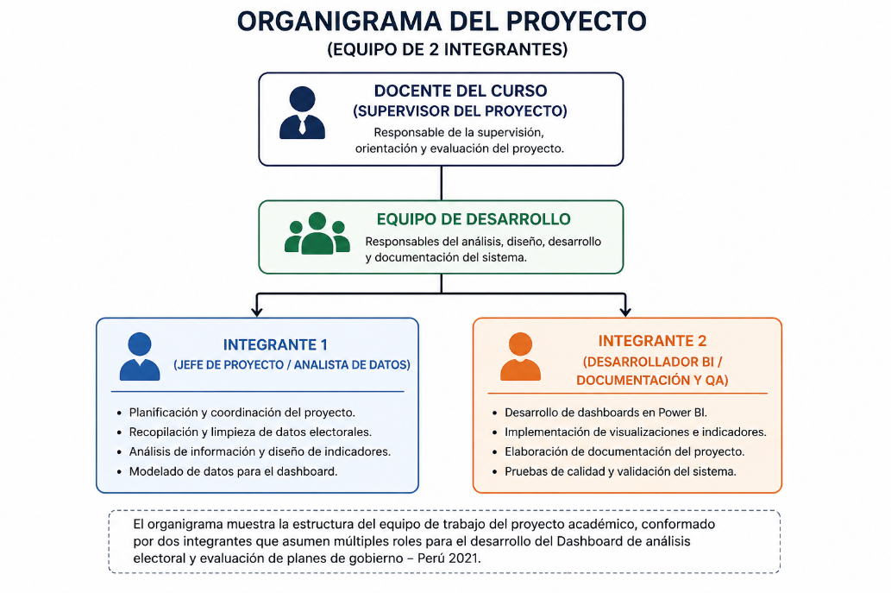
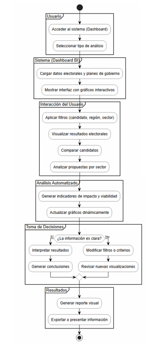
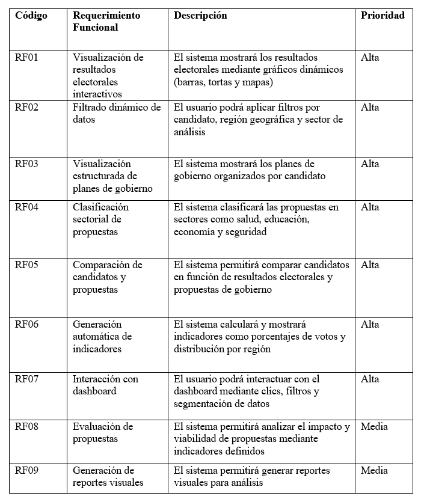
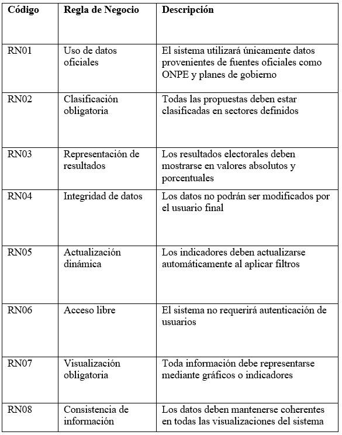
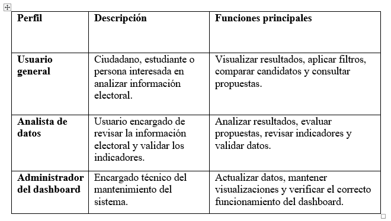
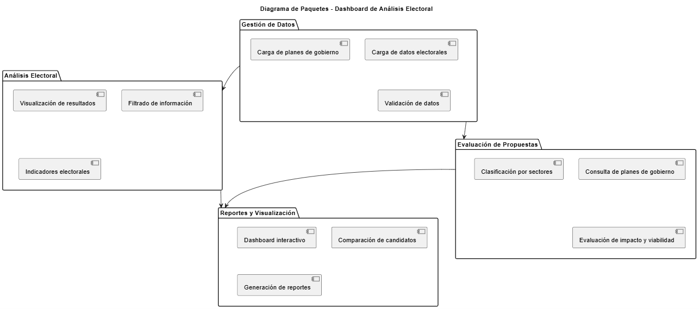
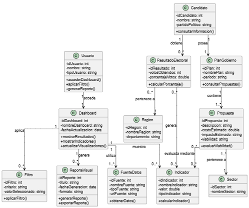

[comment]: 

**UNIVERSIDAD PRIVADA DE TACNA**

**FACULTAD DE INGENIERIA**

**Escuela Profesional de Ingeniería de Sistemas**

**Proyecto *“Dashboard de análisis electoral y evaluación de planes de gobierno - Perú 2026” ***

Curso: *Inteligencia de Negocios *

Docente: *Mag. Patrick Jose Cuadros Quiroga*

Integrantes:

***Chura Ticona, Mary Luz        (2019065163)***
***Diego Chara Apaza			 (2019065026)***

**Tacna – Perú**

***2026***

**  
**

\pagebreak

|CONTROL DE VERSIONES||||||
| :-: | :- | :- | :- | :- | :- |
|Versión|Hecha por|Revisada por|Aprobada por|Fecha|Motivo|
|1\.0|MPV|ELV|ARV|10/10/2020|Versión Original|

**Sistema *{Nombre del Sistema}***

**Documento de SRS**

**Versión *{1.0}***
**

\pagebreak

|CONTROL DE VERSIONES||||||
| :-: | :- | :- | :- | :- | :- |
|Versión|Hecha por|Revisada por|Aprobada por|Fecha|Motivo|
|1\.0|MPV|ELV|ARV|10/10/2020|Versión Original|

\pagebreak

---

## INTRODUCCIÓN

El presente documento describe de manera detallada los requerimientos del sistema denominado Dashboard de análisis electoral y evaluación de planes de gobierno - Perú 2021. El objetivo del sistema es facilitar el análisis de información electoral mediante herramientas de inteligencia de negocios, específicamente a través de dashboards interactivos desarrollados en Power BI.
Este documento establece los requerimientos funcionales y no funcionales, así como los modelos de análisis y diseño del sistema, con el fin de proporcionar una base sólida para su desarrollo e implementación.
El sistema permitirá transformar datos electorales en información útil para la toma de decisiones, contribuyendo a mejorar la comprensión de los procesos electo

---

\pagebreak

## I. GENERALIDADES DE LA EMPRESA

### 1. Nombre de la Empresa
Universidad Privada de Tacna - Proyecto Académico de Inteligencia de Negociosrales y la evaluación de propuestas de gobierno.

### 2. Visión
Ser referentes en la formación de ingenieros de sistemas a nivel nacional, destacando por el desarrollo de soluciones tecnológicas innovadoras basadas en inteligencia de negocios que contribuyan al análisis de datos y la toma de decisiones.

### 3. Misión
Formar Ingenieros de Sistemas competentes, emprendedores, con conocimientos científicos, formación humanística y responsabilidad social, capaces de desarrollar soluciones de software y tecnologías de información, como sistemas de análisis de datos y dashboards, que agreguen valor a las organizaciones y a la sociedad.

### 4. Organigrama

  

<em>Figura 1. Organigrama del equipo del proyecto</em>

## II. VISIONAMIENTO DE LA EMPRESA

### 2.1. Descripción del Problema

En el Perú, la información electoral y los planes de gobierno de los candidatos presidenciales se encuentran dispersos en múltiples fuentes, como portales institucionales, documentos oficiales y medios digitales. Esta situación dificulta que los ciudadanos, estudiantes y analistas puedan acceder a información clara, organizada y comparable.

Durante las Elecciones Generales del Perú 2021, los planes de gobierno presentados por los candidatos fueron documentos extensos y técnicos, lo que limitó su comprensión y análisis por parte de los usuarios. Asimismo, los resultados electorales se presentan de manera separada, sin integrarse con el análisis de propuestas o indicadores que permitan evaluar su impacto y viabilidad.

Esta falta de integración y visualización dificulta la toma de decisiones informadas, generando una necesidad de herramientas que permitan organizar, analizar y representar la información de manera clara y accesible.

Por ello, se propone el desarrollo de un dashboard de análisis electoral que permita centralizar la información, facilitar la comparación de candidatos y mejorar la comprensión de los datos electorales.

### 2.2. Objetivos de Negocios
#### 2.2.1. Objetivo general

Desarrollar un sistema de dashboard interactivo que permita analizar información electoral y evaluar planes de gobierno, facilitando la visualización de datos, la comparación de candidatos y la toma de decisiones informadas.
#### 2.2.2. Objetivos específicos

- Centralizar la información electoral proveniente de diversas fuentes en un solo sistema.
- Facilitar la visualización de resultados electorales mediante gráficos e indicadores.
- Permitir la comparación de candidatos presidenciales y sus propuestas de gobierno.
- Analizar las propuestas según sectores como educación, salud, economía y seguridad.
- Evaluar la viabilidad de las propuestas mediante indicadores como impacto y costo estimado.
-	Proporcionar una herramienta accesible para estudiantes, ciudadanos y analistas.

### 2.3. Objetivos de Diseño

Diseñar un dashboard interactivo utilizando herramientas de inteligencia de negocios (como Power BI), que permita representar la información electoral mediante visualizaciones dinámicas, facilitando la exploración de datos, el análisis comparativo y la interpretación de resultados de manera intuitiva. 

### 2.4. Alcance del Proyecto

El proyecto contempla el desarrollo de un dashboard interactivo basado en datos de las Elecciones Generales del Perú 2021.
El sistema incluirá:
- Visualización de resultados electorales
- Comparación de candidatos presidenciales
- Clasificación de propuestas por sectores
- Análisis de impacto y viabilidad
- Uso de gráficos interactivos y filtros dinámicos
El sistema será implementado en un entorno web y estará orientado a fines académicos, por lo que no contempla integración en tiempo real con sistemas oficiales ni el manejo de datos sensibles.

### 2.5. Viabilidad del Sistema

El desarrollo del sistema de Dashboard de análisis electoral y evaluación de planes de gobierno - Perú 2021 es viable desde diferentes perspectivas, las cuales han sido analizadas en el estudio de factibilidad.

#### 2.5.1.	Viabilidad Técnica
El sistema es técnicamente viable debido a que se basa en el uso de herramientas ampliamente utilizadas en el análisis y visualización de datos, como Power BI, Microsoft Excel y Python. Estas tecnologías permiten procesar grandes volúmenes de información y generar dashboards interactivos de manera eficiente.

Asimismo, el proyecto no requiere infraestructura compleja, ya que puede ser implementado en computadoras personales y desplegado mediante servicios en la nube, utilizando herramientas como AWS o Azure. Esto reduce la complejidad técnica y facilita su desarrollo progresivo.

#### 2.5.2.	Viabilidad Económica
Desde el punto de vista económico, el proyecto es viable, ya que presenta resultados favorables según el análisis financiero realizado.

- Costo total del proyecto: S/ 8,275.70
- Relación Beneficio/Costo (B/C): 1.33
- Valor Actual Neto (VAN): S/ 2,242.94
- Tasa Interna de Retorno (TIR): 4.6%

La relación B/C mayor a 1 indica que los beneficios superan los costos. Asimismo, el VAN positivo demuestra que el proyecto genera valor económico después de recuperar la inversión inicial.
Aunque la TIR es menor a la tasa de descuento (8%), el proyecto se considera viable debido a su enfoque académico y a los beneficios indirectos que genera, como la optimización del tiempo de análisis y el acceso a información organizada.

#### 2.5.3.	Viabilidad Operativa

El sistema es operativamente viable, ya que los usuarios objetivo (estudiantes, analistas y ciudadanos) cuentan con conocimientos básicos en el uso de herramientas digitales, lo que facilita su adopción.
El dashboard será diseñado con una interfaz intuitiva, permitiendo la interacción mediante gráficos, filtros y reportes dinámicos. Además, el sistema puede mantenerse y actualizarse fácilmente sin requerir recursos adicionales significativos, lo que garantiza su funcionamiento continuo.

#### 2.5.4.	Viabilidad Legal
El proyecto es legalmente viable, ya que se basa en el uso de información pública proveniente de fuentes oficiales, como datos electorales y planes de gobierno.
Asimismo, cumple con la normativa vigente en el Perú, especialmente con la Ley N° 29733 – Ley de Protección de Datos Personales, que regula el uso adecuado de la información.

El sistema no recopila ni almacena datos sensibles de los usuarios, ya que su finalidad es la visualización y análisis de datos públicos. Además, se respetan las licencias de las herramientas utilizadas, como Power BI, Python y otras tecnologías de uso académico.

#### 2.5.5.	Viabilidad Social
El sistema presenta una alta viabilidad social, ya que contribuye a mejorar el acceso a la información electoral, facilitando su comprensión mediante visualizaciones claras y organizadas.

Esto permite a los usuarios tomar decisiones más informadas, promoviendo la transparencia y fortaleciendo la participación ciudadana. Asimismo, el proyecto tiene un impacto positivo en el ámbito educativo, al servir como herramienta de aprendizaje en análisis de datos.

#### 2.5.6.	Viabilidad Ambiental
El proyecto es ambientalmente viable, ya que se basa en el uso de herramientas digitales, reduciendo el consumo de papel y otros recursos físicos.

Además, al utilizar infraestructura tecnológica existente y servicios en la nube, se minimiza el impacto ambiental, promoviendo el uso eficiente de los recursos y contribuyendo a prácticas sostenibles.

### 2.6. Información obtenida

Durante el levantamiento de información se identificaron las siguientes necesidades:
- Acceso a información electoral organizada y confiable
- Dificultad para comparar planes de gobierno
- Necesidad de visualizaciones claras y comprensibles
- Uso de herramientas interactivas para análisis de datos
- Acceso desde cualquier dispositivo con conexión a internet
Asimismo, se identificó que los usuarios requieren una plataforma que integre resultados electorales con el análisis de propuestas, permitiendo una mejor comprensión del contexto político y social.

\pagebreak

## III. ANÁLISIS DE PROCESOS

### a) Proceso Actual

El análisis electoral se realiza manualmente mediante documentos y reportes dispersos.

  

<em>Figura 2. Proceso actual</em>

---

### b) Proceso Propuesto

El sistema automatiza el análisis mediante dashboards.

  

<em>Figura 3. Proceso propuesto</em>

---

\pagebreak

## IV. ESPECIFICACIÓN DE REQUERIMIENTOS DE SOFTWARE

### a) Requerimientos Funcionales Inicial

  

---

### b) Requerimientos No Funcionales

  

---

### c) Requerimientos Funcionales Final

  

---

### d) Reglas de Negocio

  

  

\pagebreak

## V. FASE DE DESARROLLO

### 5.1. Perfiles de Usuario

  

  

---

### 5.2. Modelo Conceptual

#### 5.2.1. Diagrama de paquetes

  

<em>Figura 4. Diagrama de paquetes</em>

#### 5.2.2. Diagrama de Casos de Usos

  

<em>Figura 5. Diagrama de casos de usos</em>

---

### 3. Modelo Lógico

  

<em>Figura 5. Diagrama de clases</em>

---

\pagebreak

## CONCLUSIONES

El desarrollo del sistema Dashboard de análisis electoral y evaluación de planes de gobierno – Perú 2021 permite centralizar información electoral y política en una plataforma visual e interactiva, facilitando el análisis de resultados, la comparación de candidatos y la evaluación de propuestas de gobierno.
El sistema propuesto responde a la problemática identificada, ya que reduce la dispersión de información y mejora la comprensión de los datos mediante gráficos, filtros e indicadores dinámicos. Asimismo, permite que estudiantes, ciudadanos y analistas puedan acceder a información organizada para realizar análisis más claros y fundamentados.
A través de la especificación de requerimientos, casos de uso, análisis de objetos y diagramas UML, se logró definir la estructura funcional y lógica del sistema, proporcionando una base sólida para su posterior implementación en herramientas de inteligencia de negocios como Power BI.
Finalmente, el proyecto demuestra viabilidad técnica, operativa, económica, legal, social y ambiental, debido al uso de herramientas accesibles, datos públicos y una propuesta orientada al fortalecimiento de la transparencia informativa y la toma de decisiones informadas.

---

## RECOMENDACIONES

Se recomienda continuar con la implementación del dashboard priorizando las funcionalidades principales, como la visualización de resultados electorales, la comparación de candidatos y la consulta de planes de gobierno.
También se recomienda validar la información utilizada con fuentes oficiales, como datos electorales publicados por organismos competentes y documentos oficiales de planes de gobierno, con el fin de garantizar la confiabilidad del análisis.
Asimismo, se sugiere realizar pruebas con usuarios finales para evaluar la facilidad de uso del dashboard, la claridad de las visualizaciones y la utilidad de los filtros e indicadores implementados.
Finalmente, se recomienda considerar futuras mejoras, como la incorporación de nuevos procesos electorales, mayor detalle por región, nuevos indicadores de análisis y opciones adicionales de exportación de reportes visuales.

---

## BIBLIOGRAFÍA

- ONPE  
- Datos abiertos Perú  

---

## WEBGRAFÍA

- https://www.onpe.gob.pe